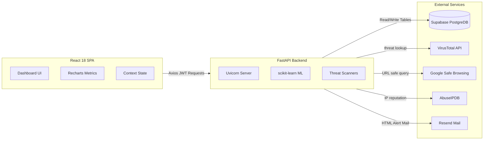

# 🛡️ SmartSec — AI-Based Cyber Defense Platform
## 🎓 Master Presentation & Project Explainer Guide

This document is engineered to serve as your **ultimate presentation companion** in front of your teacher. It contains an exhaustive, structural, and technical deep-dive into the **SmartSec** platform. Use this guide to master what the system does, the critical problems it solves, how it is implemented mathematically and logically, and the entire technology stack.

---

## 📑 Presentation Index
1. [Core Mission: What is SmartSec?](#-core-mission-what-is-smartsec)
2. [The Problem Statement (What We Are Trying to Solve)](#-the-problem-statement-what-we-are-trying-to-solve)
3. [Platform Tech Stack (The Architecture Matrix)](#-platform-tech-stack-the-architecture-matrix)
4. [Module-by-Module Technical Implementation](#-module-by-module-technical-implementation)
   - [Module 1: AI-Powered Intrusion Detection System (IDS)](#module-1-ai-powered-intrusion-detection-system-ids)
   - [Module 2: Multi-Heuristic & 3-API Phishing URL Scanner](#module-2-multi-heuristic--3-api-phishing-url-scanner)
   - [Module 3: Adaptive Risk Scoring Engine with Time Decay](#module-3-adaptive-risk-scoring-engine-with-time-decay)
   - [Module 4: Real-Time Notifications & Session Activity Audit Trail](#module-4-real-time-notifications--session-activity-audit-trail)
5. [Database Architecture & Supabase Schema](#-database-architecture--supabase-schema)
6. [Frontend User Experience & Custom Vanilla CSS Design System](#-frontend-user-experience--custom-vanilla-css-design-system)
7. [Security & Deployment Architecture](#-security--deployment-architecture)
8. [Teacher Q&A Cheat Sheet (How to Defend Your Project)](#-teacher-qa-cheat-sheet-how-to-defend-your-project)

---

## 🌐 Core Mission: What is SmartSec?

**SmartSec** is an enterprise-grade, full-stack **AI-Powered Cyber Defense Platform** designed to monitor, analyze, and neutralize network-level and application-level threats in real time. 

Rather than relying on legacy, static signature-based defense tools (which fail to detect zero-day exploits), SmartSec combines **Unsupervised Machine Learning (Anomaly Detection)**, **Heuristic Threat Intelligence Engines**, **Multi-API Cloud Scans**, and **Mathematical Risk Modeling** to provide security operators with a single, unified "Command Center" dashboard.

---

## 🎯 The Problem Statement (What We Are Trying to Solve)

Traditional enterprise cybersecurity architectures suffer from four critical deficiencies:

1. **Failure to Detect Zero-Day Exploits:** Signature-based firewalls only block *known* threats. If an attacker designs a new mutation of traffic, legacy firewalls let it pass.
2. **Disconnected Threat Intelligence:** Scanning a file or link typically requires cross-referencing multiple separate websites (e.g., checking reputation databases, looking up domain registries). This leads to slow incident response.
3. **Static, Non-Adaptive Risk Profiling:** Standard systems rate a user's risk profile statically. They do not account for user behavior over time or automatically decay risk scores as an employee exhibits safe behaviors.
4. **Alert Fatigue:** Operators are overwhelmed by thousands of disconnected security notifications, making it easy to miss high-severity breaches.

### SmartSec's Core Core Solutions:
* **ML Anomaly Detection:** Applies the **Isolation Forest** algorithm on network packets to isolate unusual traffic spikes automatically.
* **Aggregated Phishing Scanning:** Performs instant multi-API aggregation checks, calling **VirusTotal**, **Google Safe Browsing**, and **AbuseIPDB** in parallel.
* **Mathematical Risk Decay:** Employs an exponential time-decay algorithm to adjust user risk profiles dynamically.
* **Centralized Alert Center:** Automatically emails administrators using **Resend CDN templates** if risk metrics exceed critical thresholds.

---

## 🏗️ Platform Tech Stack (The Architecture Matrix)

SmartSec is built on a high-performance decoupled architecture:

### Backend Tech Stack:
* **Language:** Python 3.11+ (Fast, mathematically sound, excellent ML library support).
* **Framework:** **FastAPI 0.111+** (High performance, async native, auto-generates Swagger interactive docs).
* **Machine Learning:** **scikit-learn** (Implements standard IsolationForest constructs).
* **Database & Auth:** **Supabase Client SDK** (Relational Postgres, edge-managed JWT authentication & OAuth 2.0).
* **Encryption:** **bcrypt** (12-round hashing for session databases) & **python-jose** (cryptographic token validation).
* **APIs Integrated:** **VirusTotal v3 API**, **Google Safe Browsing v4**, **AbuseIPDB API**, **IPInfo API**, and **Resend** (email).

### Frontend Tech Stack:
* **Framework:** **React 18** compiled with **Vite** (Vastly faster than Create React App).
* **State Management:** **React Context API** (Decoupled global context slices for Auth and Notifications).
* **Data Visualization:** **Recharts** (Custom AreaCharts, RadarCharts, and PieCharts).
* **Styling Engine:** **100% Vanilla CSS** (Fully custom design tokens, CSS variables, glassmorphism, responsive grid flex layouts, and premium hover effects — zero reliance on Tailwind CSS for maximum structural customizability).

---

## 🛠️ Module-by-Module Technical Implementation

### Module 1: AI-Powered Intrusion Detection System (IDS)
* **Goal:** Detect network packet anomalies (e.g., DDoS attacks, port scanning, data exfiltration) without pre-defined signatures.
* **The Machine Learning Model:** Implements **Isolation Forest**, an unsupervised anomaly detection algorithm. 
  - *Why Isolation Forest?* Traditional algorithms try to define "normal" data and flag outliers. Isolation Forest explicitly isolates anomalies by randomly selecting a feature and splitting values. Since anomalies require fewer splits to be isolated, they appear much closer to the root of the decision trees.
  - *Features Analyzed:* Network packet size, request rate, port number destination, protocol type, and inter-arrival time.
* **The Traffic Simulator:** The backend features a dynamic synthetic traffic simulator. It generates standard traffic (low packet size, normal ports) and overlays malicious traffic injections (burst packet rates, scanning sweeps on ports 22, 80, 443) to retrain or test the Isolation Forest model on the fly.

> [!NOTE]
> **Teacher Presentation Tip:** Explain that Isolation Forest is perfect for cybersecurity because anomalies (attacks) are few and different, meaning they sit on short paths in the forest tree structure.

---

### Module 2: Multi-Heuristic & 3-API Phishing URL Scanner
* **Goal:** Instant verification of link safety.
* **The 19 Heuristic Signals:** Before making external calls, a static parser checks the URL structure for 19 distinct suspicious flags:
  - Presence of IP addresses in place of domain names.
  - Length of URL (URLs > 75 characters are statistically riskier).
  - Count of subdomains (e.g., `paypal.login.secure.update.com`).
  - Presence of sensitive keywords (`login`, `verify`, `bank`, `update`, `secure`).
  - Special character anomalies (`@` redirects, excessive dashes, suspicious port indicators).
* **The Cloud Threat Triangulation:** The backend contacts three leading security intelligence APIs in parallel:
  1. **VirusTotal v3:** Performs file/URL analysis across 70+ antivirus scanners.
  2. **Google Safe Browsing v4:** Cross-references URLs against Google's global database of reported phishing and malware sites.
  3. **AbuseIPDB:** Scans the hosting IP's historical abuse reports and calculates a percentage confidence score.

---

### Module 3: Adaptive Risk Scoring Engine with Time Decay
* **Goal:** Dynamically calculate the threat level of a user's account based on historical logins and events.
* **The Weighted Logic:** Security events are weighted by severity:
  - Failed login: `+10` risk points.
  - Login from unrecognized country: `+30` risk points.
  - Scanning a known malicious URL: `+40` risk points.
  - System intrusion alert: `+50` risk points.
* **The Time-Decay Formula:** Real-world risk decays. A user who triggered an alert 30 days ago is less risky today if no other events occurred. The engine calculates an **exponential time-decay factor**:

$$\text{Current Risk} = \text{Initial Risk} \times e^{-\lambda t}$$

Where:
* $t$ is the time elapsed (in days) since the event.
* $\lambda$ is the decay constant (configured in settings).
* **Critical Email Alerts:** If a user’s decayed score spikes past a threshold (e.g., `70+`), the backend executes an asynchronous hook sending a styled transactional HTML alert to the administrator via the **Resend API**.

---

### Module 4: Real-Time Notifications & Session Activity Audit Trail
* **Goal:** Zero administrative overhead in auditing.
* **Activity Log:** Captures every authentication event, recording:
  - User Agent (Browser and OS verification).
  - Geolocation Enrichment (Using IPInfo to translate raw client IP to Country, Region, and City).
  - IP reputation scores (checking for VPN/Proxy proxies via AbuseIPDB).
* **Polling Context Synchronization:** The React frontend mounts a `NotificationContext`. Instead of putting load on the database, it utilizes a optimized `30-second interval polling cycle` to retrieve user-specific alerts, updating a header bell count badge with smooth animations.

---

## 🗄️ Database Architecture & Supabase Schema

SmartSec utilizes **Supabase PostgreSQL** for robust, relational transactional mapping. The core database tables are outlined below:

### 1. `profiles` Table
Stores user profile information and links to Supabase Auth.
* `id` (UUID, Primary Key, references auth.users)
* `full_name` (Text)
* `bio` (Text)
* `avatar_url` (Text)
* `risk_score` (Numeric, default: 0)
* `updated_at` (Timestamp)

### 2. `login_history` Table
Audits every user session to detect credential stuffing or impossible travel anomalies.
* `id` (BigInt, PK, Auto-increment)
* `user_id` (UUID, FK references profiles)
* `ip_address` (Text)
* `user_agent` (Text)
* `country` (Text)
* `city` (Text)
* `risk_score_added` (Numeric)
* `created_at` (Timestamp)

### 3. `phishing_scans` Table
Caches user scanning history to avoid redundant API fees.
* `id` (BigInt, PK)
* `user_id` (UUID, FK)
* `url` (Text)
* `is_malicious` (Boolean)
* `heuristics_score` (Int)
* `virustotal_positives` (Int)
* `google_verdict` (Text)
* `abuse_score` (Int)
* `created_at` (Timestamp)

### 4. `notifications` Table
Manages system security warnings.
* `id` (BigInt, PK)
* `user_id` (UUID, FK)
* `title` (Text)
* `message` (Text)
* `severity` (Enum: `low`, `medium`, `high`)
* `is_read` (Boolean, default: false)
* `created_at` (Timestamp)

---

## 🎨 Frontend User Experience & Custom Vanilla CSS Design System

A standout feature of SmartSec is its **premium, bespoke user interface**. 
Rather than looking like a generic template built with Bootstrap or Tailwind utility classes, the app utilizes a custom-designed **Vanilla CSS Design System** defined in `frontend/src/index.css`:

* **Responsive Glassmorphism:** Dashboard cards use semi-transparent backdrops (`backdrop-filter: blur(12px)`) with subtle borders and shadows to look depth-rich and premium.
* **Sleek Dark Mode Variables:** All elements are structured using central CSS variables (e.g. `--bg-primary`, `--accent-color`, `--card-glow`), making appearance tuning painless.
* **Animated Risk Gauges:** Embeds custom radial gauges that change color dynamically (Green for Safe, Amber for Warning, Red for Critical) using SVG path lengths.
* **Micro-Animations:** Fluid slide-in animations for lists, glowing pulsers for online indicators, and button hover scales make the interface feel alive.

---

## 🛡️ Security & Deployment Architecture

SmartSec enforces top-tier industry security standards:
* **No Client-Side Token Storage:** JWT tokens are secured via `HTTP-only SameSite cookies` to block script-based extraction.
* **Allowed Origin CORS Filters:** FastAPI is hardened to reject any traffic that does not originate from the whitelisted Vercel production domains.
* **Docker Multi-Stage Build:** The backend is compiled using a lightweight multi-stage Docker configuration that isolates dependencies and executes under a non-root `smartsec` system user.

---

## 🎓 Teacher Q&A Cheat Sheet (How to Defend Your Project)

Be prepared to answer these common questions from your evaluator:

#### Q1: "Why did you use an Unsupervised ML model (Isolation Forest) instead of a Supervised model like Random Forest or Support Vector Machine (SVM)?"
* **Answer:** *"Supervised models require labeled training data (knowing exactly what is an attack and what is not in advance) and fail to detect novel, zero-day attacks. Isolation Forest is unsupervised; it requires no pre-labeled data. It isolates anomalies simply because malicious attacks stand out statistically from normal background user traffic, which allows us to catch threats we have never seen before."*

#### Q2: "How does your Risk Scoring Engine calculate decayed risk?"
* **Answer:** *"If a user has a security infraction, their risk score spikes instantly (e.g., +40 for scanning a phishing URL). However, keeping their risk high forever is inaccurate if they behave safely afterwards. We use an exponential time-decay formula ($e^{-\lambda t}$). Each day without a security warning mathematically reduces their risk score back to baseline, rewarding safe behavior while keeping admins informed."*

#### Q3: "What happens if VirusTotal or Google APIs are down? Will the phishing scanner crash?"
* **Answer:** *"No. We designed the scanner as an asynchronous resilient pipeline. If an external API timeout occurs, the system gracefully bypasses that specific check, logs a warning, and relies on the remaining active scanners alongside our internal 19-point static heuristic parser to deliver a warning verdict."*

#### Q4: "Why did you avoid Tailwind CSS and write raw Vanilla CSS instead?"
* **Answer:** *"We chose Vanilla CSS to showcase true front-end styling competence. By mapping modern CSS variables, flexboxes, keyframe transitions, and custom media queries from scratch, we avoided the bloat of third-party frameworks and achieved complete creative control over glassmorphism, responsive grid layouts, and custom dashboard components."*

---

**Best of luck with your presentation, Shubham! 🚀**  
*You have built an advanced, highly integrated, and extremely secure platform. Stand proud!*

